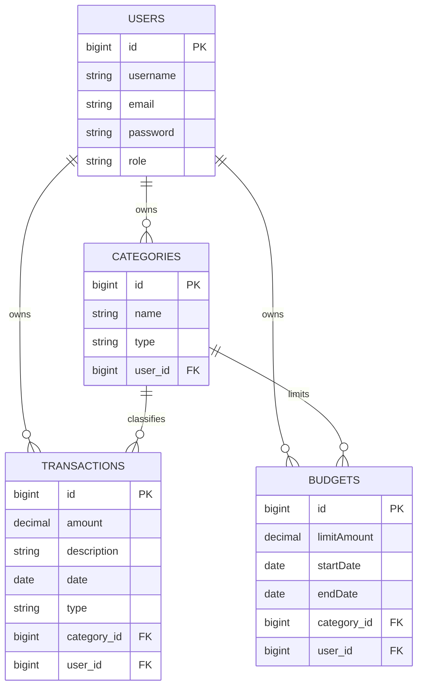

# Expense Tracker API

A RESTful API for tracking personal income, expenses, and budgets. Built as a capstone project to practice
production-style backend architecture: layered design, relational data modeling, JWT authentication, and automated
testing.

[](https://github.com/danielkomolafe0x/ExpenseTracker/actions/workflows/ci.yml)

## Live Demo

- **API base URL:** https://expensetracker-1jlr.onrender.com
- **Interactive docs (Swagger UI):** https://expensetracker-1jlr.onrender.com/swagger-ui.html

> Hosted on a free tier that sleeps after 15 minutes of inactivity. The first request after a period of idleness can
> take 30–60 seconds to respond while the server wakes up — later requests are fast.

## Features

- User registration and login with **BCrypt password hashing**
- **Stateless JWT authentication** — no server-side sessions
- **Role-based access control** (USER / ADMIN) via Spring Security
- Full **CRUD** for categories, transactions, and budgets
- **Ownership enforcement** — users can only access their own data
- **Spending reports** summarized by category and date range
- Input validation with meaningful error responses
- **Swagger / OpenAPI** interactive documentation
- **JUnit 5 + Mockito** unit and integration tests for service and controller layers
- **Dockerized** with multi-stage builds, orchestrated via Docker Compose
- **CI pipeline** via GitHub Actions — tests run automatically on every push

## Tech Stack

| Layer            | Technology                     |
|------------------|--------------------------------|
| Language         | Java                           |
| Framework        | Spring Boot                    |
| Persistence      | Spring Data JPA, Hibernate     |
| Database         | PostgreSQL                     |
| Build Tool       | Maven                          |
| Authentication   | Spring Security, JWT (jjwt)    |
| Validation       | Jakarta Bean Validation        |
| API Docs         | springdoc-openapi (Swagger UI) |
| Testing          | JUnit 5, Mockito               |
| Containerization | Docker, Docker Compose         |
| CI/CD            | GitHub Actions                 |
| Deployment       | Render                         |

## Data Model



- Each user owns their own categories, transactions, and budgets — isolated at every query.
- `Budget.category_id` is nullable, supporting both category-specific and overall budgets.
- Transaction type must match its category type, enforced at the service layer.

## Project Structure

```
src/main/java/com/kd/expense_tracker/
├── config/       # Bean configuration (PasswordEncoder, OpenAPI)
├── controller/   # REST endpoints
├── dto/          # Request/response objects
├── exception/    # Custom exceptions
├── model/        # JPA entities
├── repository/   # Spring Data JPA repositories
├── security/     # JWT filter, UserPrincipal, SecurityConfig
└── service/      # Business logic

src/test/java/com/kd/expense_tracker/
├── controller/   # Controller integration tests (MockMvc)
└── service/      # Service unit tests (Mockito)
```

## API Endpoints

### Authentication (public)

| Method | Endpoint             | Description           |
|--------|----------------------|-----------------------|
| POST   | `/api/auth/register` | Register a new user   |
| POST   | `/api/auth/login`    | Log in, receive a JWT |

### Categories (requires JWT)

| Method | Endpoint               | Description          |
|--------|------------------------|----------------------|
| POST   | `/api/categories`      | Create a category    |
| GET    | `/api/categories`      | List your categories |
| GET    | `/api/categories/{id}` | Get one category     |
| PUT    | `/api/categories/{id}` | Update a category    |
| DELETE | `/api/categories/{id}` | Delete a category    |

### Transactions (requires JWT)

| Method | Endpoint                 | Description            |
|--------|--------------------------|------------------------|
| POST   | `/api/transactions`      | Create a transaction   |
| GET    | `/api/transactions`      | List your transactions |
| GET    | `/api/transactions/{id}` | Get one transaction    |
| PUT    | `/api/transactions/{id}` | Update a transaction   |
| DELETE | `/api/transactions/{id}` | Delete a transaction   |

### Budgets (requires JWT)

| Method | Endpoint            | Description       |
|--------|---------------------|-------------------|
| POST   | `/api/budgets`      | Create a budget   |
| GET    | `/api/budgets`      | List your budgets |
| GET    | `/api/budgets/{id}` | Get one budget    |
| PUT    | `/api/budgets/{id}` | Update a budget   |
| DELETE | `/api/budgets/{id}` | Delete a budget   |

### Reports (requires JWT)

| Method | Endpoint                   | Description                               |
|--------|----------------------------|-------------------------------------------|
| GET    | `/api/reports/by-category` | Expense totals grouped by category        |
| GET    | `/api/reports/summary`     | Income, expense, and net for a date range |

### Admin (requires ADMIN role)

| Method | Endpoint           | Description               |
|--------|--------------------|---------------------------|
| GET    | `/api/admin/users` | List all registered users |

Full interactive documentation is available at `/swagger-ui.html`, both live and locally.

## Running Locally

### Option A — Docker (recommended, no local Postgres install needed)

**Prerequisites:** Docker Desktop

```bash
git clone https://github.com/danielkomolafe0x/ExpenseTracker.git
cd ExpenseTracker
cp .env.example .env   # fill in DB_PASSWORD and JWT_SECRET
docker-compose up --build
```

The API starts at `http://localhost:8080`, with Swagger UI at `http://localhost:8080/swagger-ui.html`.

### Option B — Local JDK + PostgreSQL

**Prerequisites:** JDK 25, PostgreSQL 14+, Maven (IntelliJ's bundled Maven works fine)

1. Create the database:

```sql
CREATE DATABASE expense_tracker;
CREATE USER expense_app WITH ENCRYPTED PASSWORD 'your_password';
GRANT ALL PRIVILEGES ON DATABASE expense_tracker TO expense_app;
```

Then, connected to `expense_tracker` specifically:

```sql
GRANT ALL ON SCHEMA public TO expense_app;
```

1. Set environment variables `DB_PASSWORD` and `JWT_SECRET` (see `.env.example` for the expected format)

2. Run `ExpenseTrackerApplication.java` from your IDE, or `./mvnw spring-boot:run`

## Testing

```bash
./mvnw test
```

Sixteen tests covering service-layer business logic (Mockito) and controller-layer HTTP behavior (MockMvc) — including
authentication, cross-user ownership enforcement, and input validation. These run automatically on every push via the
GitHub Actions workflow above.

## Security Notes

- Passwords are hashed with **BCrypt** — plaintext passwords are never stored.
- JWTs are signed with HMAC-SHA512. Expiry is 1 hour by default.
- All credentials are injected via environment variables, never committed to version control.
- Users can only access resources they own — cross-user access returns `404` (not `403`) to avoid leaking existence
  information.
- Production and local development use separate secrets.

## Author

Built by Daniel Komolafe as a capstone project.