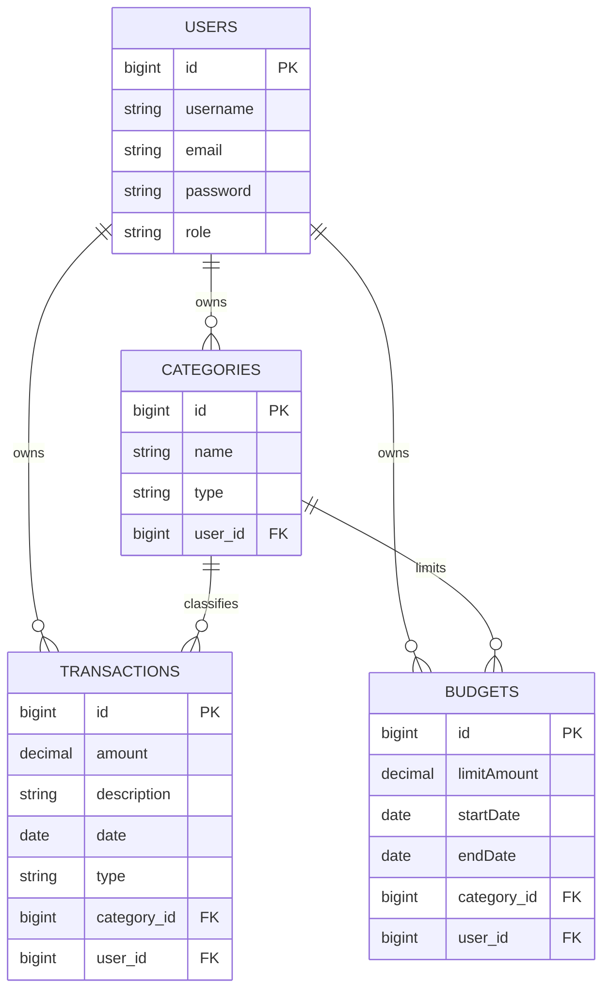

# Expense Tracker API

A RESTful API for tracking personal income, expenses, and budgets, built with Java and Spring Boot. This is a capstone project built incrementally to practice production-style backend architecture: layered design, relational data modeling, authentication, and testing.

> **Status:** Actively in development. This README reflects what's implemented so far and will be updated as features are completed.

## Features

### Implemented
- User registration with input validation and secure password hashing (BCrypt)
- Relational data model for users, categories, transactions, and budgets
- Layered architecture: Controller → Service → Repository → Database
- Full CRUD for categories, transactions, and budgets
- JWT-based authentication and role-based access control (USER / ADMIN)

### Planned
- Spending summary endpoints by category and date range
- API documentation via Swagger / OpenAPI
- Unit and integration tests with JUnit and Mockito

## Tech Stack

| Layer | Technology                     |
|---|--------------------------------|
| Language | Java 25                         |
| Framework | Spring Boot                    |
| Persistence | Spring Data JPA, Hibernate     |
| Database | PostgreSQL                     |
| Build Tool | Maven                          |
| Validation | Jakarta Bean Validation        |
| Auth (planned) | Spring Security, JWT           |
| Testing (planned) | JUnit 5, Mockito               |
| API Docs (planned) | springdoc-openapi (Swagger UI) |

## Data Model



- Each `User` owns their own categories, transactions, and budgets.
- `Category` links to both `Transaction` and `Budget`, enabling spending summaries by category.
- `Budget.category_id` is nullable, allowing either category-specific or overall budgets.

## Project Structure

```
src/main/java/com/kd/expense_tracker/
├── model/        # JPA entities
├── repository/   # Spring Data JPA repositories
├── service/      # Business logic
├── controller/   # REST endpoints
├── dto/          # Request/response objects
└── config/       # Bean configuration (e.g. PasswordEncoder)
```

## Getting Started

### Prerequisites
- JDK 17 or newer
- PostgreSQL 14+
- Maven

### 1. Clone the repository
```bash
git clone <your-repo-url>
cd expense-tracker
```

### 2. Create the database
In PostgreSQL (via `psql` or pgAdmin's Query Tool):
```sql
CREATE DATABASE expense_tracker;
CREATE USER expense_app WITH ENCRYPTED PASSWORD 'your_password_here';
GRANT ALL PRIVILEGES ON DATABASE expense_tracker TO expense_app;
```
Then, connected to the `expense_tracker` database specifically:
```sql
GRANT ALL ON SCHEMA public TO expense_app;
```

### 3. Configure credentials
`application.properties` reads the database password from an environment variable rather than storing it in the file (see [Security Notes](#security-notes)). Set `DB_PASSWORD` in your IDE's run configuration or system environment before running the app.

### 4. Run the application
In IntelliJ: right-click `ExpenseTrackerApplication.java` → **Run**.

Or from the command line:
```bash
./mvnw spring-boot:run
```

The API will be available at `http://localhost:8080`.

## API Endpoints

| Method | Endpoint | Description | Auth Required |
|---|---|---|---|
| POST | `/api/auth/register` | Register a new user | No |

More endpoints are added as development progresses. Once Swagger is integrated, full interactive documentation will be available at `/swagger-ui.html`.

## Security Notes

- Passwords are hashed with BCrypt before storage — plaintext passwords are never persisted.
- Database credentials are injected via environment variables, not hardcoded in version control.
- JWT-based authentication and role-based access control are planned for an upcoming phase.

## Author

Daniel Komolafe — built as a capstone project to practice backend engineering with Spring Boot.
